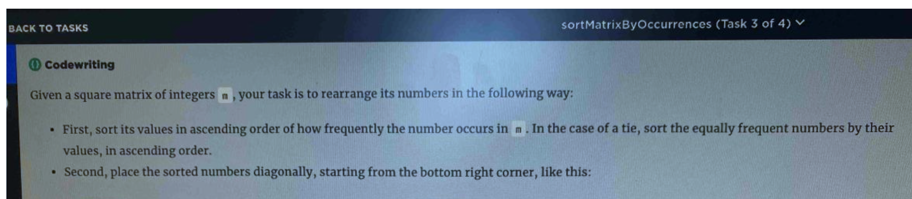

# 1.4 Sorting

## Sorting排序算法

### complexity

稳定\*\*：如果a原本在b前面，而a=b，排序之后a仍然在b的前面。


### coding

### \#Bubble Sort

性质：1、时间复杂度：O\(n2\) 2、空间复杂度：O\(1\) 3、稳定排序 4、原地排序

```python
def sortIntegers(self, A):
        # write your code here
        for i in range(len(A)-1):
            for j in range(len(A) - 1 - i):
                if A[j] > A[j+1]:
                A[j], A[j + 1] = A[j + 1], A[j]
```

**优化一下冒泡排序的算法**

改进思路1：设置标志位，明显如果有一趟没有发生交换（flag = false\)，说明排序已经完成  
改进思路2：记录一轮下来标记的最后位置，下次从头部遍历到这个位置就Ok


### \#Selection Sort

性质：1、时间复杂度：O\(n2\) 2、空间复杂度：O\(1\) 3、非稳定排序 4、原地排序

```python
def sortIntegers(self, A):
        # write your code here
        for i in range(len(A)-1):
            minIndex = i 
            for j in range(i+1, len(A)):
                if A[j] < A[minIndex]:
                    minIndex = j 
            A[i], A[minIndex] = A[minIndex], A[i] 
        return A
```

### \#Insertion Sort

性质：1、时间复杂度：O\(n2\) 2、空间复杂度：O\(1\) 3、稳定排序 4、原地排序

```python
def sortIntegers(self, A):
        # write your code here
        for i in range(len(A)-1):
            curnum = A[i+1] #num for insert
            preIn = i #position for insert
            while preIn >= 0 and A[preIn] > curnum:
                A[preIn + 1]= A[preIn]
                preIn -= 1 
            A[preIn + 1] = curnum
        return A
```

### \#Shell Sort

性质：1、时间复杂度：O\(n^1.5\) 2、空间复杂度：O\(1\) 3、非稳定排序 4、原地排序

```python
def sortIntegers(self, A):
        # write your code here
        gap = 1 
        while gap < len(A) //3:
            gap = gap*3+1 #dynamic gap
        while gap > 0:
            for i in range(gap, len(A)):
                curNum, preIndex = A[i], i - gap  # curNum 保存当前待插入的数
                while preIndex >= 0 and curNum < A[preIndex]:
                    A[preIndex + gap] = A[preIndex] # 将比 curNum 大的元素向后移动
                    preIndex -= gap
                A[preIndex + gap] = curNum  # 待插入的数的正确位置
            gap //= 3  # 下一个动态间隔
        return A
```

### \#Merge Sort

1、时间复杂度：O\(nlogn\) 2、空间复杂度：O\(n\) 3、稳定排序 4、非原地排序

```python
def sortIntegers(self,A):
        if len(A) <= 1: return A
        middle = len(A) // 2 
        A1 = A[:middle]
        A2 = A[middle:]
        self.sortIntegers(A1)
        self.sortIntegers(A2)
        k = 0
        while len(A1) and len(A2):
            if A1[0] < A2[0]: A[k]=A1.pop(0)
            else: A[k]=A2.pop(0)
            k = k + 1

        while len(A1):
            A[k] = A1.pop(0)
            k = k + 1
        while len(A2):
            A[k] = A2.pop(0)
            k = k + 1   

#Merge sort v2
class Solution:
    """
    @param A: an integer array
    @return: nothing
    """
    def sortIntegers2(self,A):
        if A is None or len(A)==0:
            return
        tmp = [0] * len(A)
        self.mergeSort(A,0,len(A)-1, tmp)

    def mergeSort(self, A, start, end, tmp):
        if start >= end:
            return
        mid = (end + start)//2 
        self.mergeSort(A, start, mid, tmp)
        self.mergeSort(A, mid + 1, end, tmp)
        self.merge(A, start, end, tmp)

    def merge(self, A, start, end, tmp):
        mid = (end + start)//2
        leftIndex = start   
        rightIndex = mid + 1 
        Index = leftIndex 

        while leftIndex<= mid and rightIndex <= end :
            if A[leftIndex] < A[rightIndex]:
                tmp[Index] = A[leftIndex]
                leftIndex += 1 
            else:     
                tmp[Index] = A[rightIndex]
                rightIndex += 1 
            Index += 1     

        while leftIndex <= mid :
            tmp[Index] = A[leftIndex]
            Index += 1 
            leftIndex += 1 

        while rightIndex <= end :
            tmp[Index] = A[rightIndex]    
            Index += 1 
            rightIndex += 1 

        for i in range(start, end+1):
            A[i] = tmp[i]
            
            
/ 非递归式的归并排序
 3    public static int[] mergeSort(int[] arr) {
 4        int n = arr.length;
 5        // 子数组的大小分别为1，2，4，8...
 6        // 刚开始合并的数组大小是1，接着是2，接着4....
 7        for (int i = 1; i < n; i += i) {
 8            //进行数组进行划分
 9            int left = 0;
10            int mid = left + i - 1;
11            int right = mid + i;
12            //进行合并，对数组大小为 i 的数组进行两两合并
13            while (right < n) {
14                // 合并函数和递归式的合并函数一样
15                merge(arr, left, mid, right);
16                left = right + 1;
17                mid = left + i - 1;
18                right = mid + i;
19            }
20            // 还有一些被遗漏的数组没合并，千万别忘了
21            // 因为不可能每个字数组的大小都刚好为 i
22            if (left < n && mid < n) {
23                merge(arr, left, mid, n - 1);
24            }
25        }
26        return arr;
27    }
```

### \#quick sort

性质：1、时间复杂度：O\(nlogn\) 2、空间复杂度：O\(1\) 3、非稳定排序 4、原地排序

```python
def sortIntegers2(self, A):
        # write your code here
        if not A or len(A) == 0:
            return
        self.quickSort(A, 0, len(A)-1)

    def quickSort(self, A, start, end):
        if start >= end:
            return

        left, right = start, end 
        # key point 1: pivot is the value, not the index!!!
        pivot = A[(start + end)//2] 
        # key point 2: every time, it should be left <= right not left < right 
        # otherwise, it'll exit at l=r,and each half include the same number,it'll stack overflow
        while left <= right:
                #key point 3:A[left] < pivot not <=, for more mean (1111112)
            while left <= right and A[left] < pivot: 
                left +=1 
            while left <= right and A[right] > pivot:
                right -=1 

            if left <= right:
                A[left], A[right] = A[right], A[left]
                left += 1 
                right -= 1 
        self.quickSort(A, start, right)
        self.quickSort(A, left, end)
```

### \#Heap Sort

性质：1、时间复杂度：O\(nlogn\) 2、空间复杂度：O\(1\) 3、非稳定排序 4、原地排序

```python
def sortIntegers2(self, A):
        # write your code here
        if not A or len(A) == 0:
            return
        size = len(A)
        self.buildHeap(A)
        for i in range(len(A))[::-1]:
            A[0], A[i] = A[i], A[0]
            self.adjustHeap(A,0,i)


    def buildHeap(self, A):
        size = len(A)
        if size <= 1:
            return
        for i in range(size//2)[::-1]:
            self.adjustHeap(A,i,size)

    def adjustHeap(self, A, start, size):
        if start >= size:
            return
        leftchild = start*2 + 1 
        rightchild = start*2 + 2 
        largest = start
        if leftchild < size and A[leftchild] > A[largest]:
            largest = leftchild
        if rightchild < size and A[rightchild] > A[largest]:
            largest = rightchild
        if largest != start:
            A[largest], A[start] = A[start], A[largest]
            self.adjustHeap(A, largest, size)
```

### \#Counting Sort

只能排自然数

性质：1、时间复杂度：O\(k\) 2、空间复杂度：O\(k\) 3、稳定排序 4、非原地排序

k=桶大小

```python
def countingSort(nums):
    bucket = [0] * (max(nums) + 1) # 桶的个数
    for num in nums:  # 将元素值作为键值存储在桶中，记录其出现的次数
        bucket[num] += 1
    i = 0  # nums 的索引
    for j in range(len(bucket)):
        while bucket[j] > 0:
            nums[i] = j
            bucket[j] -= 1
            i += 1
    return nums
    
```

**优化一下：** 创建的临时数组大小 \(max - min + 1\)就可以了，然后在把 min作为偏移量。

### \#Bucket Sort

桶排序就是把最大值和最小值之间的数进行瓜分，例如分成  10 个区间，10个区间对应10个桶，我们把各元素放到对应区间的桶中去，再对每个桶中的数进行排序，可以采用归并排序，也可以采用快速排序之类的。

之后每个桶里面的数据就是有序的了，我们在进行合并汇总。

性质：1、时间复杂度：O\(n+k\)  2、空间复杂度：O\(k\)  3、稳定排序  4、非原地排序

注：k 表示桶的个数，下同

```python
def bucketSort(nums, defaultBucketSize = 5):
    maxVal, minVal = max(nums), min(nums)
    bucketSize = defaultBucketSize  # 如果没有指定桶的大小，则默认为5
    bucketCount = (maxVal - minVal) // bucketSize + 1  # 数据分为 bucketCount 组
    buckets = []  # 二维桶
    for i in range(bucketCount):
        buckets.append([])
    # 利用函数映射将各个数据放入对应的桶中
    for num in nums:
        buckets[(num - minVal) // bucketSize].append(num)
    nums.clear()  # 清空 nums
    # 对每一个二维桶中的元素进行排序
    for bucket in buckets:
        insertionSort(bucket)  # 假设使用插入排序
        nums.extend(bucket)    # 将排序好的桶依次放入到 nums 中
    return nums
```

### \#Radix Sort

基数排序的排序思路是这样的：先以个位数的大小来对数据进行排序，接着以十位数的大小来多数进行排序，接着以百位数的大小……

排到最后，就是一组有序的元素了。不过，他在以某位数进行排序的时候，是用“桶”来排序的。

由于某位数（个位/十位….，不是一整个数）的大小范围为0-9，所以我们需要10个桶，然后把具有相同数值的数放进同一个桶里，之后再把桶里的数按照0号桶到9号桶的顺序取出来，这样一趟下来，按照某位数的排序就完成了

1、时间复杂度：O\(kn\) 2、空间复杂度：O\(n+k\) 3、稳定排序 4、非原地排序

```python
  # LSD Radix Sort
def radixSort(nums):
    mod = 10
    div = 1
    mostBit = len(str(max(nums)))  # 最大数的位数决定了外循环多少次
    buckets = [[] for row in range(mod)] # 构造 mod 个空桶
    while mostBit:
        for num in nums:  # 将数据放入对应的桶中
            buckets[num // div % mod].append(num)
        i = 0  # nums 的索引
        for bucket in buckets:  # 将数据收集起来
            while bucket:
                nums[i] = bucket.pop(0) # 依次取出
                i += 1
        div *= 10
        mostBit -= 1
    return nums
```

##  [Diagonal Traverse II](https://leetcode.com/problems/diagonal-traverse-ii/)

```python
#bfs
#time:O(n), space:(1)
import collections
class Solution:
    def findDiagonalOrder(self, nums: List[List[int]]) -> List[int]:
        res = []
        que = deque([(0,0)])
        while que:
            i,j = que.popleft()
            res.append(nums[i][j])
            if j == 0 and i+1<len(nums):
                que.append((i+1,j))
            if j+1<len(nums[i]):
                que.append((i,j+1))
        return res


#hash + deque
#time:O(n), space:(N)
import collections
class Solution:
    def findDiagonalOrder(self, nums: List[List[int]]) -> List[int]:
        dic = defaultdict(deque)
        for i,row in enumerate(nums):
            for j, ele in enumerate(row):
                dic[i+j].appendleft(ele)
        res = []
        for li in dic.values():
            res += li
        return res
```

## [Sort Characters By Frequency](https://leetcode.com/problems/sort-characters-by-frequency/)

```python
#hashtable O(n)
#1.hash(key=char, value = count)
#2.hash(key = count, value = str_of_this_count)
#3.connect in order
import collections
class Solution:
    def frequencySort(self, s: str) -> str:
        s1,s2 = Counter(s), {}
        for i,j in s1.items():
            s2.setdefault(j,[]).append(i*j)
        return "".join(["".join(s2[i]) for i in range(len(s),0,-1) if i in s2])
 
```

## Sort the Matrix Diagonally

[https://leetcode.com/problems/sort-the-matrix-diagonally/](https://leetcode.com/problems/sort-the-matrix-diagonally/)

```python
#hashtable 对角线编号（i-j):sorted[nums]
#O(n), O(n)
class Solution:
    def diagonalSort(self, A: List[List[int]]) -> List[List[int]]:
        n, m = len(A), len(A[0])
        d = collections.defaultdict(list)
        for i in range(n):
            for j in range(m):
                d[i - j].append(A[i][j])
        for k in d:
            d[k].sort(reverse=1)
        for i in range(n):
            for j in range(m):
                A[i][j] = d[i - j].pop()
        return A
```

## Sort matrix



```python
import collections
def solution(m):
    if not m:
        return m
    #sort m into li
    li,dic,k = [],{},len(m)
    for r in m:
        li += r
    li = collections.Counter(li)
    for i, num in li.items():
        dic.setdefault(num,[]).extend([i]*num)
    li = []
    for i in range(1,k**2+1):
        if i in dic:
            li.extend(sorted(dic[i]))
    print(li)
    #bfs
    que = collections.deque([(0,0)])
    while que:
        i,j = que.popleft()
        m[i][j] = li.pop()
        if j+1<k:
            que.append((i, j+1))
        if j == 0 and i+1<k:
            que.append((i+1,j))
    print(m)

    

if __name__ == "__main__":
    m = [[1,1,2],[2,2,3],[4,4,0]]
    solution(m)
```

## Throttling Gateway



any given second cannot exceed 3   
any given 10 second period cannot exceed 20   
any given minute cannot exceed 60Throttling Gateway

```python
#hashmap, prefix sum
import collections
def droppedRequests(requestTime):
    if not requestTime:
        return 0
    r_num_map = collections.Counter(requestTime)
    r_num = [(0,0)]+sorted([x for x in r_num_map.items()])
    start_10,start_60 = 0,0 
    ans = 0
    for i in range(1,len(r_num)):
        drop = 0
        time, cnt = r_num[i]
        r_num[i] = (time, r_num[i-1][1]+cnt)
        if cnt>3:
            drop = max(cnt-3, drop)
        while time - r_num[start_10][0] > 10:
            start_10 += 1
        if r_num[i][1] - r_num[start_10][1] > 20:
            exceed =  min(cnt, r_num[i][1] - r_num[start_10][1]-20)
            drop = max(drop, exceed)
        while time - r_num[start_60][0] > 60:
            start_60 += 1
        if r_num[i][1] - r_num[start_60][1] > 60:
            exceed =  min(cnt, r_num[i][1] - r_num[start_10][1]-60)
            drop = max(drop, exceed)
        print(drop)
        ans += drop
    return ans

r = [1, 1, 1, 1, 2, 2, 2, 3, 3, 3, 4, 4, 4, 5, 5, 5, 6, 6, 6, 7, 7, 7, 7, 11, 11, 11, 11]
print(droppedRequests(r))


```

## droppedRequests

